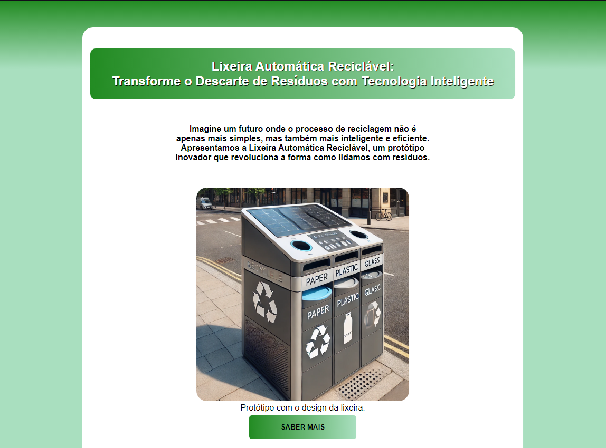

<h1 align="center">Landing Page - Lixeira Automática Reciclável</h1>

  <a href="#-tecnologias">Tecnologias</a>&nbsp;&nbsp;&nbsp;|&nbsp;&nbsp;&nbsp;
  <a href="#-projeto">Projeto</a>&nbsp;&nbsp;&nbsp;

 

## Tecnologias

Esse projeto foi desenvolvido com as seguintes tecnologias:

- HTML e CSS

## Projeto

Esse projeto consiste em apresentar uma landing page em que o foco é trazer interesse e uma possível venda desse protótipo de uma Lixeira Automática Reciclável.

 

  

  

 

  

